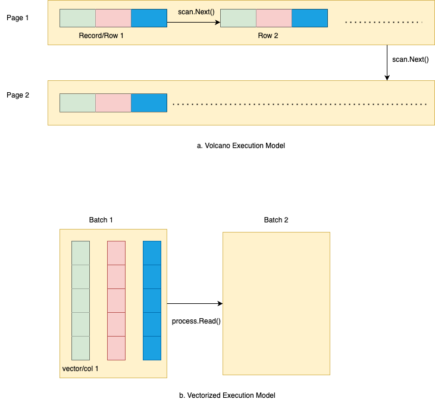

### Vectorized (Columnar) Execution Engine

#### Introduction
- This is a very basic `Vectorized Execution Engine` extracted 
from [MatrixOne](https://github.com/matrixorigin/matrixone) database.

- Some of the packages have be renamed and ordered for easy understanding.

- This supports a very primitive `Projection` and `Abs` function. 
Hopefully, this should give you a high level overview of how Columnar Execution Engines Works.

- For [Volcano](https://dbms-arch.fandom.com/wiki/Volcano_Model) based execution model, refer to my [TinyDB](https://github.com/arjunsk/tiny-db/blob/816330ef0d7e3a1f56a079de1a9950ea082b76a6/src/main/java/com/arjunsk/tiny_db/server/b_query_engine/impl/basic/b_execution_engine/A_Select_RWRecordScan.java#L42) Java Project.
    - You can see the use of `Next()` being applied at row/record level.
    - You can see how this is a [pull based approach](https://justinjaffray.com/query-engines-push-vs.-pull/).
- In Vectorized execution
  - We do a push based approach, by storing the `batch` in `Process Register`.
  - We execute operation on the Column level, as see in the `ColExec`. 
  - These operations can make use of SIMD if required.

#### Pending issues
- Passing `Attr` to the result `Batch`
- Documentation
- Implement a Parquet based Storage Engine/Reader

#### Good Reads
- [CockroachDB Article](https://www.cockroachlabs.com/blog/how-we-built-a-vectorized-execution-engine/)
- [A good structure rust project](https://github.com/dylan-p-wong/sql-engine)

#### Pending Reads
- [Crate Issue with Links](https://github.com/crate/crate/issues/10063)
- [Push vs Pull based](https://justinjaffray.com/query-engines-push-vs.-pull/)
- [SIMD](https://15721.courses.cs.cmu.edu/spring2023/slides/08-vectorization.pdf)

#### Disclaimer
Some of the code could be wrong or buggy. I am also learning about database internals. 
If you find a bug, please feel free to raise a PR.